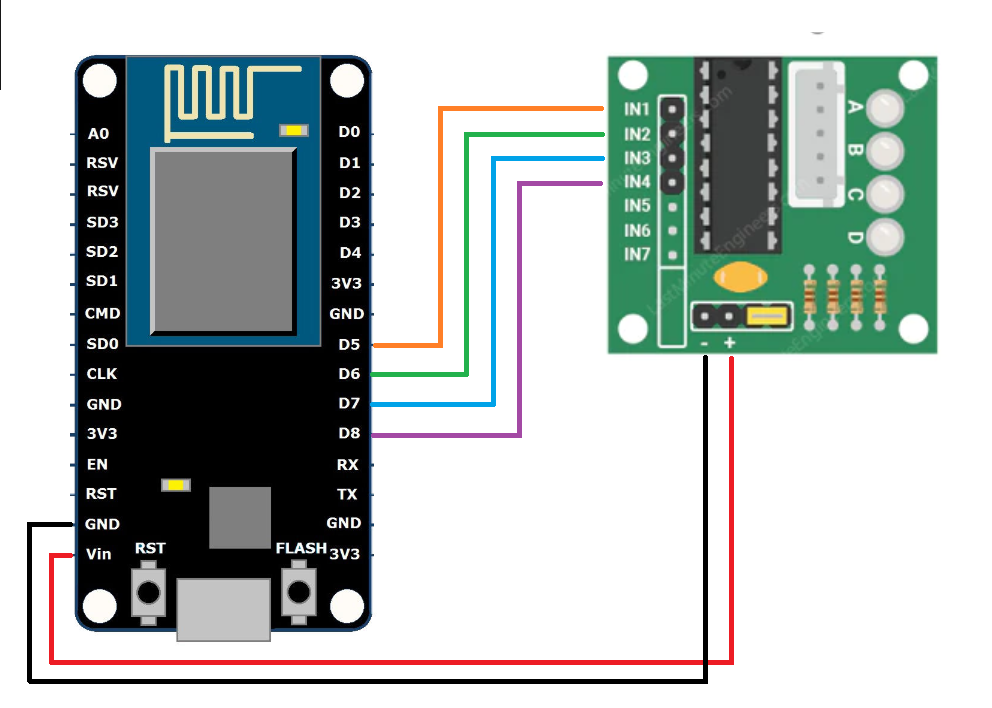
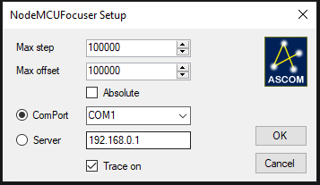
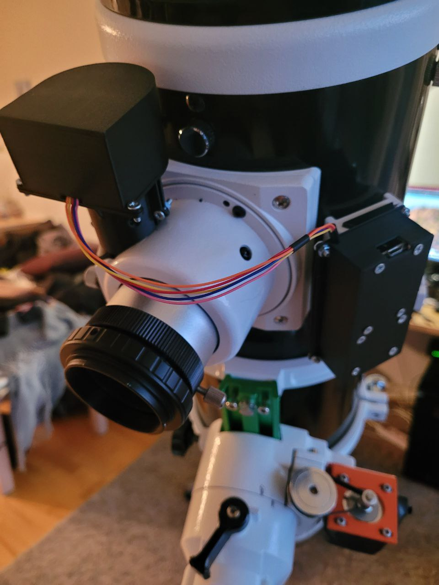
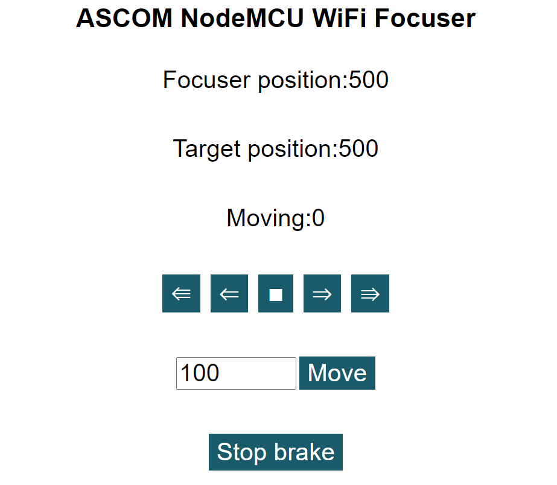

# NodeMCUFocuser
DIY focuser based on NodeMCU board and 28BYJ-48 DC Gear Stepper Motor with ULN2003

Required hardware:
* NodeMCU v3 board
* 5V 28BYJ-48 stepper with ULN2003
* shaft coupler 4x5 mm
* wires

# Simple instruction

1. Wiring



2. Comile and upload firmware via Arduino IDE. Arduino project is in [folder](NodeMCUFocuserHardware/NodeMCUFocuser). Don't forget to download all neccessary libs via manager.

3. Don't forget to restore defaults WiFi and IP settings via pressing FLASH buttom for 5 seconds right after powering up (settings are stored in EEPROM and can't be written during uploading firmware)

4. Install ASCOM drivers for windows - [installer](NodeMCUFocuserSetup/Release/NodeMCUFocuserSetup.msi)

Device allows to use COM-port or network



There is ready to print holder's STL model for 2" Craiford 2 speed focuser:
 * [Holder](NodeMCUFocuserHardware/Holder.stl)
 * [Holder motor cover](NodeMCUFocuserHardware/HolderBox.stl)
 * [BoardBox](NodeMCUFocuserHardware/BoardsBox.stl)

Mounted on scope it looks like that



#Web interface
Also you can use your browser to be able to manipulate with focuser. Just folow IP address you provide in settings or default address(192.168.0.1) if you haven't changed it.


It shows current status of focuser and allows:
 * Perform small or large steps forward and backward
 * Perform custom amount of steps (positive number forward, negative - backward)
 * Stop focuser moving on current position
 * Stop motor brake to ba able to move focuser manually

# Project structure:
* NodeMCUFocuser - Visual Studio C# project with SCOM driver for focuser
* NodeMCUFocuserHardware - Arduino project with firmware and STL models for holder
* NodeMCUFocuserSettings - simple Windows application which allows to change device WiFi and IP configuration
* NodeMCUFocuserSetup - installer project

# Troubleshouting

1. If device doesn't appear in the focusers list, you can try run next command with admin rights in the folder where you installed driver:
```
    ASCOM.NodeMCUFocuser.exe -register
```

2. If you want restore to default WiFi and IP settings just press FLASH button for 5 seconds right after powering up.